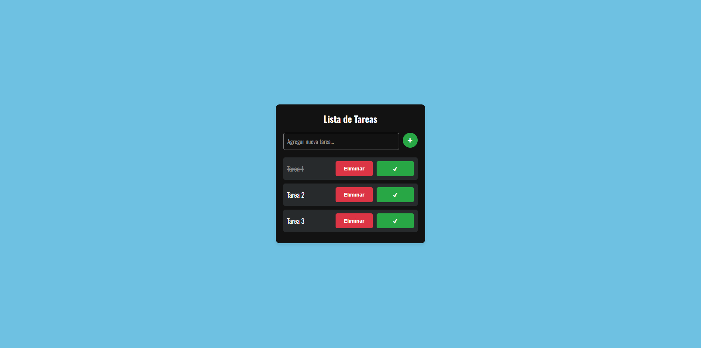
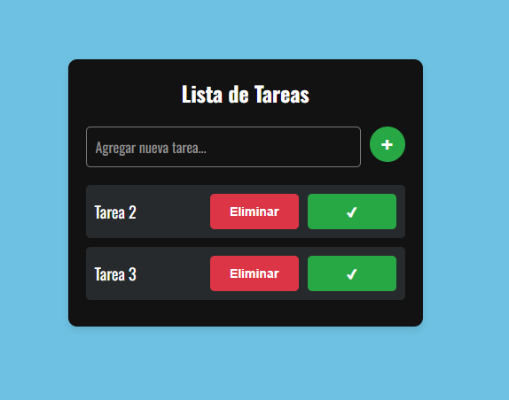

# Lista de Tareas

Una aplicación web simple para agregar, visualizar y eliminar tareas. Permite a los usuarios gestionar su lista de tareas de manera efectiva.

## Instrucciones para Ejecutar la Aplicación

1. **Clonar el repositorio**:
   ```bash
   git clone https://github.com/leoneleoss/Trabajo_03.git
   ```

2. **Navegar a la carpeta del proyecto**:
   ```bash
   cd Trabajo_03
   ```

3. **Abrir el archivo `index.html` en un navegador web**.

## Funcionamiento de la Aplicación

- **Agregar Tarea**: Escribe el texto de la tarea en el campo de entrada y haz clic en el botón "+".
- **Eliminar Tarea**: Haz clic en el botón "Eliminar" al lado de la tarea.
- **Marcar como Completada**: Haz clic en el botón "✔" para marcar la tarea como completada (el texto se tachará).
- **Persistencia**: Las tareas se guardan en `localStorage`, por lo que se mantienen después de recargar la página.

## Capturas de Pantalla

Aqui se puede ver que se añadieron 3 tareas y se marco la primera como completada 



Aquí se quito la tarea completada usando ell boton eliminar



## Material de Apoyo

### Documentación y Tutoriales:
- [MDN Web Docs - Introducción a JavaScript](https://developer.mozilla.org/es/docs/Web/JavaScript/Guide/Introduction)
- [MDN Web Docs - Manipulación del DOM](https://developer.mozilla.org/es/docs/Web/API/Document_Object_Model/Introduction)
- [W3Schools - JavaScript Tutorial](https://www.w3schools.com/js/)
- [FreeCodeCamp - JavaScript Algorithms and Data Structures](https://www.freecodecamp.org/learn/javascript-algorithms-and-data-structures/)